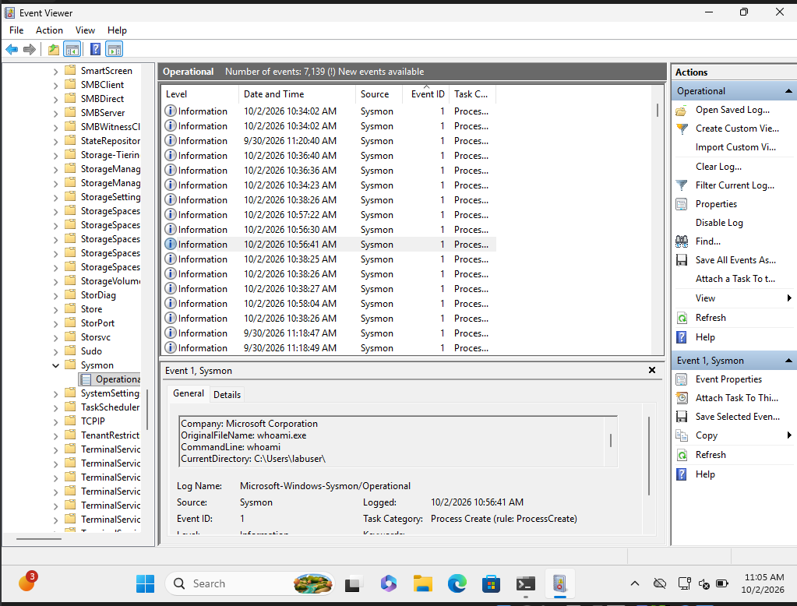
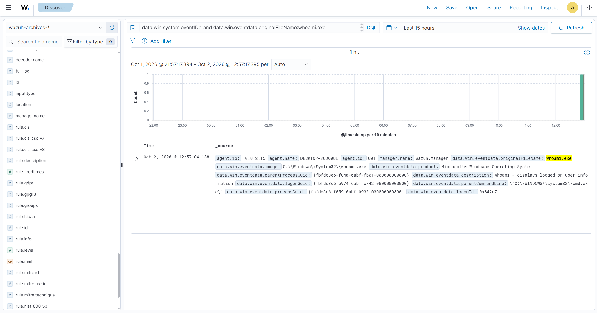

# Sysmon → Wazuh Field Mapping

How one Sysmon event looks on the endpoint and after it reaches Wazuh. The reference event is a benign `whoami` run from `cmd.exe` on the lab VM on 2026-10-02 (Phase 2).

## The trace

```
cmd.exe → whoami.exe
  → Sysmon Event ID 1 (rule tag T1033), Microsoft-Windows-Sysmon/Operational, EventRecordID 4610
  → Wazuh agent 001 (DESKTOP-3UDQ08I, 10.0.2.15) reads the event channel
  → wazuh.manager decodes it (decoder windows_eventchannel), rule 61603 (level 0)
  → archives.json → Filebeat → index wazuh-archives-4.x-2026.10.02
  → Discover: data.win.system.eventID:1 and data.win.eventdata.originalFileName:whoami.exe
```

| Stage | Timestamp (UTC) |
|---|---|
| Process created (Sysmon `UtcTime`) | 2026-10-02 17:56:41.908 |
| Event written to the channel (`SystemTime`) | 2026-10-02 17:56:41.950 |
| Received and decoded by Wazuh (`timestamp`) | 2026-10-02 17:57:04.188 |

About 22 seconds from process start to the SIEM, mostly the agent's event-channel polling plus the slow NEM-mode VM.

**On the endpoint:** Event Viewer, Sysmon/Operational, logged 10:56:41 AM VM local time (UTC-7):



**In the SIEM:** Wazuh Discover, `wazuh-archives-*`, the same event at 17:56:41 UTC (`timestamp` shows when Wazuh received it):



## Why the default lab setup never showed it

1. **Wazuh only indexes alerts.** Sysmon process creation matches rule 61603, which is level 0, so the event was analyzed and dropped. Fixed by archiving all events ([infrastructure/wazuh/README.md](../../infrastructure/wazuh/README.md#archive-all-events)).
2. **This Sysmon config logs selected processes only.** sysmon-modular's default build has 45 `ProcessCreate` *include* groups. Only matching processes produce Event ID 1. `whoami.exe` matches `technique_id=T1033`. `notepad.exe` matches nothing, so launching Notepad produced image-load (7) and registry (13) events but no process creation (1).

## Event ID 1: Process Create

| Sysmon field (Event Viewer) | Wazuh field | Value in the reference event |
|---|---|---|
| Event ID | `data.win.system.eventID` | `1` |
| Channel | `data.win.system.channel` | `Microsoft-Windows-Sysmon/Operational` |
| Provider | `data.win.system.providerName` | `Microsoft-Windows-Sysmon` |
| Computer | `data.win.system.computer` | `DESKTOP-3UDQ08I` |
| EventRecordID | `data.win.system.eventRecordID` | `4610` |
| SystemTime | `data.win.system.systemTime` | `2026-10-02T17:56:41.9497935Z` |
| RuleName | `data.win.eventdata.ruleName` | `technique_id=T1033,technique_name=System Owner/User Discovery` |
| UtcTime | `data.win.eventdata.utcTime` | `2026-10-02 17:56:41.908` |
| ProcessGuid | `data.win.eventdata.processGuid` | `{fbfdc3e6-f059-6abf-0902-000000000800}` |
| ProcessId | `data.win.eventdata.processId` | `9664` |
| Image | `data.win.eventdata.image` | `C:\\Windows\\System32\\whoami.exe` |
| FileVersion | `data.win.eventdata.fileVersion` | `10.0.26100.1882 (WinBuild.160101.0800)` |
| Description | `data.win.eventdata.description` | `whoami - displays logged on user information` |
| Product | `data.win.eventdata.product` | `Microsoft® Windows® Operating System` |
| Company | `data.win.eventdata.company` | `Microsoft Corporation` |
| OriginalFileName | `data.win.eventdata.originalFileName` | `whoami.exe` |
| CommandLine | `data.win.eventdata.commandLine` | `whoami` |
| CurrentDirectory | `data.win.eventdata.currentDirectory` | `C:\\Users\\labuser\\` |
| User | `data.win.eventdata.user` | `DESKTOP-3UDQ08I\\labuser` |
| LogonGuid | `data.win.eventdata.logonGuid` | `{fbfdc3e6-e974-6abf-c742-080000000000}` |
| LogonId | `data.win.eventdata.logonId` | `0x842c7` (Event Viewer shows `0x842C7`) |
| TerminalSessionId | `data.win.eventdata.terminalSessionId` | `1` |
| IntegrityLevel | `data.win.eventdata.integrityLevel` | `Medium` |
| Hashes | `data.win.eventdata.hashes` | `SHA1=…,MD5=…,SHA256=23240EF9…AF56CD3,IMPHASH=…` |
| ParentProcessGuid | `data.win.eventdata.parentProcessGuid` | `{fbfdc3e6-f04a-6abf-fb01-000000000800}` |
| ParentProcessId | `data.win.eventdata.parentProcessId` | `7600` |
| ParentImage | `data.win.eventdata.parentImage` | `C:\\Windows\\System32\\cmd.exe` |
| ParentCommandLine | `data.win.eventdata.parentCommandLine` | `\"C:\\WINDOWS\\system32\\cmd.exe\"` |
| ParentUser | `data.win.eventdata.parentUser` | `DESKTOP-3UDQ08I\\labuser` |
| (full rendered message) | `data.win.system.message` | Same text as the Event Viewer *General* tab |

Fields Wazuh adds:

| Wazuh field | Meaning | Value |
|---|---|---|
| `agent.id`, `agent.name`, `agent.ip` | Endpoint that sent the event | `001`, `DESKTOP-3UDQ08I`, `10.0.2.15` |
| `manager.name` | Manager that decoded it | `wazuh.manager` |
| `decoder.name` | Decoder used | `windows_eventchannel` |
| `location` | Collector on the agent | `EventChannel` |
| `timestamp` | When the manager processed it | `2026-10-02T17:57:04.188+0000` |
| `rule.*` | Matched rule. Present on alerts only, absent in archives | (none) |

## Things to remember when writing queries and rules

- **Field names are camelCase** (`commandLine`, `parentImage`), unlike Sysmon's PascalCase.
- **Backslashes are stored escaped.** `data.win.eventdata.image` holds `C:\\Windows\\System32\\whoami.exe` with doubled backslashes. Prefer matching on `originalFileName`, or on the end of the path with a wildcard.
- **Values are case-sensitive in DQL.** Windows 11 Notepad is `...\Notepad\Notepad.exe`, so `*notepad.exe` misses it. `OriginalFileName` is a steadier field than `Image`, because renaming a binary doesn't change it.
- **The GUID fields link events.** `processGuid` ties a process to its later events (network, file, registry). `parentProcessGuid` walks up the tree. `logonGuid` groups everything in one logon session. These are the backbone of an investigation timeline.
